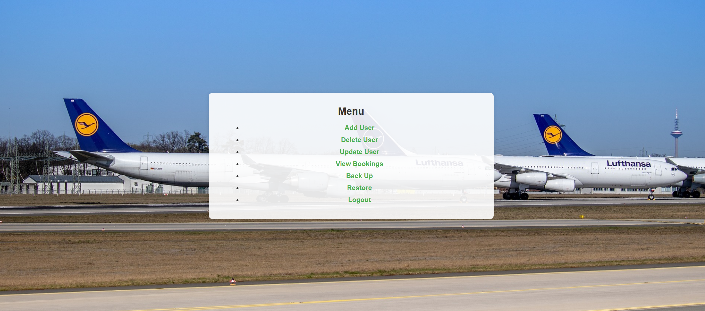

# flight_booking_website
Simple example of flight_booking_website.

The function of update users is waiting to be refined.

## Quick Start

1. Import the database using "sql/flight_booking.sql".
2. Change "$password" in "php/flight_booking/db.php"  into the password of **your own** db password.

## Example

## Tips

Login as admin using username "admin" and password "654321". You can change it in "sql/flight_booking.sql:line 110". 